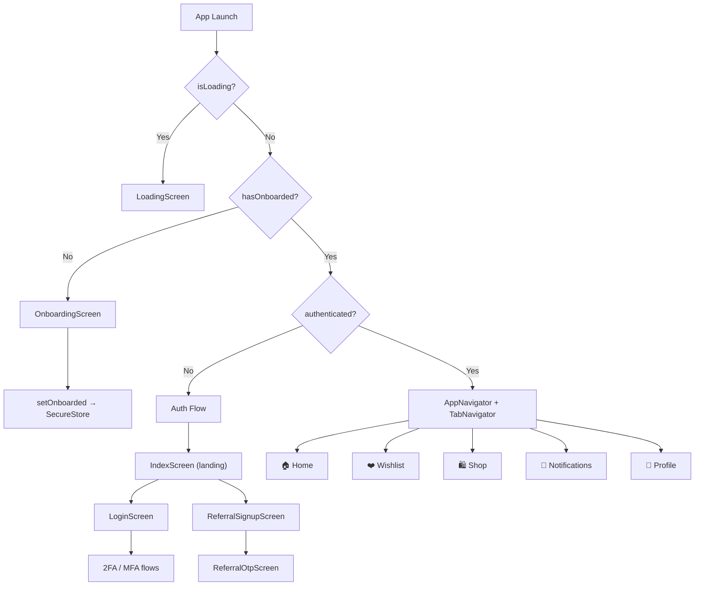

# 📦 Apsara Home Mobile – Project Overview

## What Is This App?

**Apsara Home (AFHome)** is an **e-commerce mobile application** for a Philippine-based furniture/home-goods company. It is built with **React Native + Expo** and talks to a Laravel backend at `https://backend.afhome.ph/api`.

The app allows users to:

- Browse, search, and purchase furniture & home products
- Manage a cart and wishlist
- Check out via online payment (with PayMongo integration)
- Track orders (pending → shipped → delivered)
- Manage their profile, referrals, and an affiliate/MLM-style wallet
- Receive real-time push notifications (Firebase + OneSignal + Pusher)

---

## Tech Stack

| Layer              | Technology                                                         |
| ------------------ | ------------------------------------------------------------------ |
| Framework          | **React Native 0.81** via **Expo SDK 54**                          |
| Language           | **TypeScript**                                                     |
| Navigation         | `@react-navigation/native` v7 + `@react-navigation/bottom-tabs` v7 |
| State / Data       | `@tanstack/react-query` v5, React Context, local `useState`        |
| HTTP Client        | **Axios**                                                          |
| Search Engine      | **Meilisearch** (hosted at `search.afhome.ph`)                     |
| Real-time          | **Pusher** (private channels per user)                             |
| Push Notifications | **Firebase Cloud Messaging** + **OneSignal**                       |
| Auth Persistence   | `expo-secure-store` (encrypted key-value)                          |
| Social Login       | `@react-native-google-signin/google-signin`                        |
| Payment            | **PayMongo** (via backend, rendered in a WebView)                  |
| Biometrics         | `expo-local-authentication`                                        |
| Styling            | React Native `StyleSheet` with a custom `Colors` constant          |

---

## Folder Structure

```
d:\PROJECTS\Apsara-Home-Mobile\
├── App.tsx                     ← Root component (auth flow + navigation shell)
├── index.ts                    ← Expo entry point
├── package.json
├── app.json / eas.json         ← Expo / EAS Build config
├── google-services.json        ← Firebase config (Android)
├── .env.example                ← Environment variable template
│
├── src/
│   ├── config/
│   │   └── api.ts              ← Base URL + Meilisearch config
│   │
│   ├── constants/
│   │   ├── colors.ts           ← Brand color palette
│   │   └── tierConfig.ts       ← Badge/rank tier images
│   │
│   ├── context/
│   │   ├── AppContext.tsx       ← Global app state shared via React Context
│   │   └── NavigationContext.tsx
│   │
│   ├── hooks/                  ← Reusable React hooks
│   │   ├── useDeviceRegistration.ts
│   │   ├── useFirebaseMessaging.ts
│   │   ├── useNotifications.ts
│   │   ├── useOneSignalTokenRegistration.ts
│   │   ├── useOptimizedProducts.ts
│   │   ├── usePrefetchProducts.ts
│   │   ├── useProducts.ts
│   │   ├── useRecommendations.ts
│   │   ├── useTokenRefresh.ts
│   │   └── useWishlist.ts
│   │
│   ├── navigation/
│   │   ├── AppNavigator.tsx    ← Master navigator (modals, deep links, state)
│   │   └── TabNavigator.tsx    ← Bottom tab bar (5 tabs)
│   │
│   ├── screen/                 ← 53 screen files (see 02-screens-guide.md)
│   │
│   ├── services/               ← API service layer (see 03-api-reference.md)
│   │   ├── authService.ts
│   │   ├── productService.ts
│   │   ├── orderService.ts
│   │   ├── referralService.ts
│   │   ├── accountService.ts
│   │   ├── storageService.ts
│   │   ├── meilisearchService.ts
│   │   ├── userBehaviorService.ts
│   │   ├── googleSignInService.ts
│   │   ├── notificationService.ts
│   │   ├── oneSignalNotificationService.ts
│   │   └── pusherService.ts
│   │
│   ├── utils/
│   │   ├── biometricUtils.ts
│   │   ├── fcmUtils.ts
│   │   └── firebaseMessaging.ts
│   │
│   └── components/             ← Reusable UI components
│       ├── AppHeader/
│       ├── BottomSheetSelector/
│       ├── Button/
│       ├── ChatBot/
│       ├── ConfirmationModal/
│       ├── DailyCheckin/
│       ├── Items/
│       ├── LevelProgress/
│       ├── MissionTasks/
│       ├── Referral/
│       ├── ScrollToTopButton/
│       ├── SearchResults/
│       ├── SkeletonLoader/
│       └── WebAuthnView.tsx
│
├── assets/                     ← Images, icons, fonts
├── android/                    ← Native Android project
└── docker/                     ← Docker config (likely for backend dev)
```

---

## High-Level App Flow



> [!NOTE]
> The app uses a **manual screen-state-machine** (no stack navigator for auth). The `App.tsx` root toggles between auth screens using a `screen` state variable (`'index' | 'login' | 'signup' | 'otp' | 'referral-signup' | 'referral-otp'`). Once authenticated, it renders the full `<NavigationContainer>` with `AppNavigator`.
