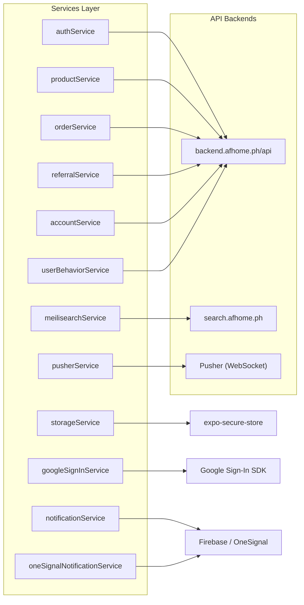
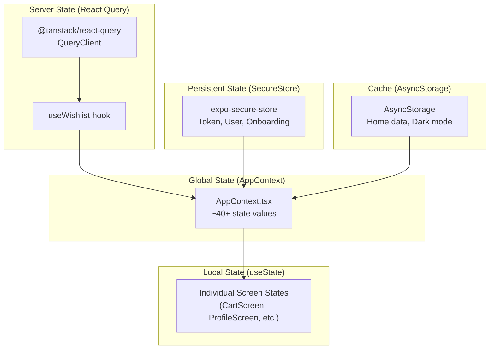
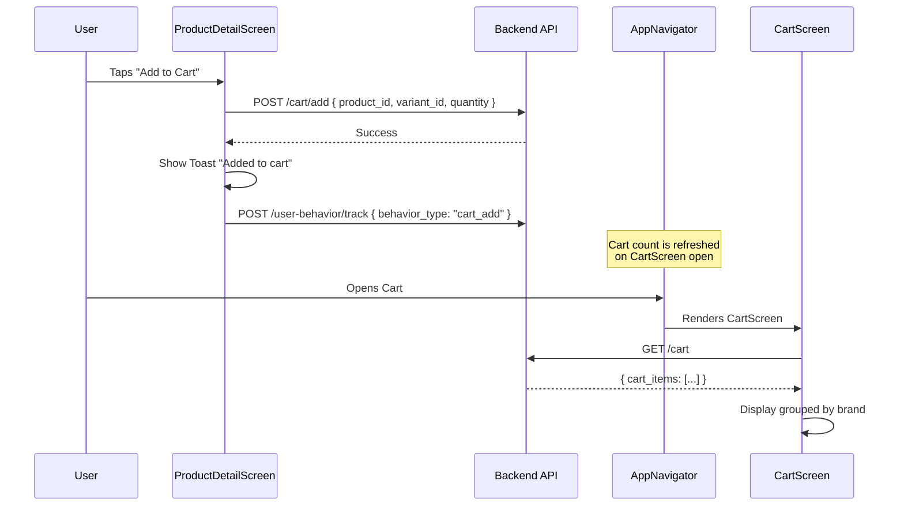
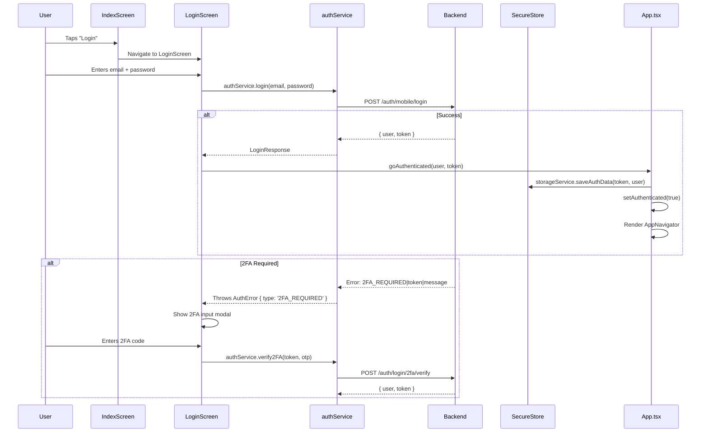

# 🏗️ Architecture Deep Dive – Services, Hooks, State & Data Flow

This document explains **how the code is organized** under the hood: how data flows from the API to the UI, how state is managed, and how the service layer works.

---

## Service Layer Overview

All API communication is centralized in `src/services/`. Each service creates its own `axios` instance with the shared base URL.



---

## Service Files Explained

### [authService.ts](file:///d:/PROJECTS/Apsara-Home-Mobile/src/services/authService.ts)

**Responsibility**: All authentication + some miscellaneous data fetching.

> [!WARNING]
> This file also handles non-auth concerns like `getSearchHistory()`, `getBrands()`, `getBrandProfile()`, and `getShopByCategories()`. This is a historical design decision — these could be refactored into their own services.

Key methods:

- `login()` — Email/password login with full error handling (401, 403, 2FA, MFA)
- `mobileRegister()` — New user registration
- `verifyRegisterOtp()` — OTP verification after signup
- `sendSmsOtp()` / `verifySmsOtp()` — Phone verification
- `googleLogin()` — Google ID token → backend auth
- `verify2FA()` / `resend2FA()` — Two-factor auth
- `checkMFAStatus()` / `resendMFA()` — Multi-factor approval polling
- `getCurrentUser()` — Fetch `/auth/me`

---

### [productService.ts](file:///d:/PROJECTS/Apsara-Home-Mobile/src/services/productService.ts)

**Responsibility**: Product CRUD and shop data.

Key features:

- **Response normalization**: Handles multiple response shapes (`data.products`, `data.data`, `data.items`, or raw array)
- `toProductCard()` — Transforms full `Product` into lightweight `ProductCard`
- Wishlist fetching: `getWishlist()`
- Shop metadata: `getShopByRooms()`, `getShopByCategories()`, `getShopByBrands()`

---

### [orderService.ts](file:///d:/PROJECTS/Apsara-Home-Mobile/src/services/orderService.ts)

**Responsibility**: Order counts, notifications, cart clearing.

Small but important — provides `getOrderCounts()` used by the Profile screen's order summary.

---

### [referralService.ts](file:///d:/PROJECTS/Apsara-Home-Mobile/src/services/referralService.ts)

**Responsibility**: Referral tree and public profile lookup.

- `getReferralTree()` — Authenticated, returns the user's full downline tree
- `getPublicProfile()` — Unauthenticated, used when displaying referral invite modals

---

### [accountService.ts](file:///d:/PROJECTS/Apsara-Home-Mobile/src/services/accountService.ts)

**Responsibility**: Account snapshot with loyalty/tier data.

Single method: `getAccountSnapshot()` returns rank, tier, PV, and member counts.

---

### [meilisearchService.ts](file:///d:/PROJECTS/Apsara-Home-Mobile/src/services/meilisearchService.ts)

**Responsibility**: Product search via Meilisearch.

- `liveSearch()` — Quick search for autocomplete suggestions (limit 10)
- `searchProducts()` — Full search with results mapped to `ProductCard` format

> [!NOTE]
> Meilisearch uses its own axios client pointing to `search.afhome.ph` with a static search API key. This is completely separate from the main API authentication.

---

### [userBehaviorService.ts](file:///d:/PROJECTS/Apsara-Home-Mobile/src/services/userBehaviorService.ts)

**Responsibility**: User behavior tracking for personalized recommendations.

Tracks events like `product_view`, `cart_add`, `wishlist_add`, `purchase`, `search`, then uses that data to serve `getRecommendations()`.

---

### [storageService.ts](file:///d:/PROJECTS/Apsara-Home-Mobile/src/services/storageService.ts)

**Responsibility**: Encrypted local storage for auth data.

Uses `expo-secure-store` (not `AsyncStorage`) for security. Key behaviors:

- **Token expiry**: Tokens are considered expired after **7 days** (checked via stored timestamp)
- **Auto-cleanup**: Expired tokens are automatically cleared
- **Session extension**: `refreshTokenTimestamp()` resets the 7-day timer

Stored keys:
| Key | Purpose |
|---|---|
| `auth_token` | JWT Bearer token |
| `auth_user` | Full user object (JSON) |
| `token_timestamp` | When the token was stored |
| `has_onboarded` | Onboarding completion flag |
| `chatbot_icon_hidden` | UI preference |

---

### [pusherService.ts](file:///d:/PROJECTS/Apsara-Home-Mobile/src/services/pusherService.ts)

**Responsibility**: WebSocket connection for real-time notifications.

Key design decisions:

- **Singleton** pattern — one `PusherService` instance for the whole app
- **Private channels** — subscribes to `private-customer-{userId}`
- **Auto-reconnect** — exponential backoff up to 5 attempts
- **Lifecycle management** — `goBackground()` disconnects, `goForeground()` reconnects
- **Custom authorizer** — uses `POST /realtime/pusher/auth` with Bearer token

---

### [googleSignInService.ts](file:///d:/PROJECTS/Apsara-Home-Mobile/src/services/googleSignInService.ts)

**Responsibility**: Google Sign-In wrapper.

Flow: `GoogleSignin.signIn()` → get `idToken` → `authService.googleLogin(idToken)` → save token + user.

---

### [notificationService.ts](file:///d:/PROJECTS/Apsara-Home-Mobile/src/services/notificationService.ts) & [oneSignalNotificationService.ts](file:///d:/PROJECTS/Apsara-Home-Mobile/src/services/oneSignalNotificationService.ts)

**Responsibility**: Notification tap handling and OneSignal initialization.

Both services parse the `href` field from notifications using the pattern: `{scheme}://{status}/{identifier}` (e.g., `purchases://delivered/cs_abc123`) and navigate to the appropriate screen.

---

## Hooks Layer

Hooks in `src/hooks/` wrap services with React lifecycle integration:

### [useNotifications.ts](file:///d:/PROJECTS/Apsara-Home-Mobile/src/hooks/useNotifications.ts)

Manages the Pusher connection lifecycle and provides:

- `notifications` — live notification array
- `unreadCount` — real-time badge count
- `markAsRead()` / `clearNotifications()`

Handles app state changes (background/foreground) to disconnect/reconnect Pusher.

### [useWishlist.ts](file:///d:/PROJECTS/Apsara-Home-Mobile/src/hooks/useWishlist.ts)

React Query wrapper for `productService.getWishlist()` — provides cached, auto-refetching wishlist data.

### [useRecommendations.ts](file:///d:/PROJECTS/Apsara-Home-Mobile/src/hooks/useRecommendations.ts)

Wraps `userBehaviorService.getRecommendations()` with loading/error state.

### [useDeviceRegistration.ts](file:///d:/PROJECTS/Apsara-Home-Mobile/src/hooks/useDeviceRegistration.ts)

Automatically registers the device for push notifications when `token` and `userId` become available. Creates a persistent UUID device ID in SecureStore.

### [useFirebaseMessaging.ts](file:///d:/PROJECTS/Apsara-Home-Mobile/src/hooks/useFirebaseMessaging.ts)

Handles Firebase Cloud Messaging (FCM) token retrieval and foreground notification display.

### [useTokenRefresh.ts](file:///d:/PROJECTS/Apsara-Home-Mobile/src/hooks/useTokenRefresh.ts)

Validates tokens and triggers refresh when needed.

---

## State Management Architecture

The app uses a **hybrid state management** approach:



### AppContext (Global State)

[AppContext.tsx](file:///d:/PROJECTS/Apsara-Home-Mobile/src/context/AppContext.tsx) provides **~40+ values** to all tab screens via React Context. This includes:

- Auth data (`token`, `enrichedUser`)
- UI state (`isDarkMode`, `activeTab`, `cartCount`)
- Navigation state (`selectedProductId`, `selectedBrandId`, `searchQuery`, etc.)
- All callback functions (`onProductPress`, `onCartPress`, etc.)

> [!IMPORTANT]
> The `AppNavigator.tsx` is the **true state owner**. It creates all state variables and passes them down through `AppContextProvider`. The `AppContext` is just the plumbing — `AppNavigator` is where the logic lives.

### AppNavigator as State Machine

[AppNavigator.tsx](file:///d:/PROJECTS/Apsara-Home-Mobile/src/navigation/AppNavigator.tsx) (~2500 lines, 96KB) is the heart of the app. It manages:

1. **All modal screens** via boolean states (`showCart`, `showCheckout`, `showPurchases`, etc.)
2. **Data caching** — home screen data is cached in `AsyncStorage` and restored on mount
3. **Deep link handling** — parses URLs for payment, product, referral, and order deep links
4. **Cart/notification counts** — fetched on mount and updated via API calls
5. **Dark mode** — persisted in `AsyncStorage`, restored on mount

### Caching Strategy

```
App Mount
  ├── Read AsyncStorage cache (categories, brands, rooms, products, dark mode)
  ├── Display cached data immediately
  └── Fetch fresh data from API in background
        ├── Step 1: Categories first (fast, ~200ms) → show screen
        └── Step 2: Brands, rooms, products (lazy loaded in parallel)
```

This gives users an **instant-feeling** home screen even on slow connections.

---

## Data Flow Example: Adding to Cart



---

## Data Flow Example: Authentication



---

## Key Design Patterns

### 1. Response Normalization

Many services handle multiple response formats from the backend:

```typescript
// productService.ts handles 4 possible shapes:
if (Array.isArray(response.data)) products = response.data
else if (response.data.data) products = response.data.data
else if (response.data.products) products = response.data.products
else if (response.data.items) products = response.data.items
```

### 2. Optimistic Updates

Cart and wishlist use optimistic UI updates — the UI changes immediately and reverts on API error:

```typescript
// CartScreen: optimistic quantity update
snapshot = { ...cartItem };
updateCartItemInState(crtId, item => ({ ...item, crt_quantity: newQuantity }));
try { await axios.put(...); }
catch { updateCartItemInState(crtId, () => snapshot); }
```

### 3. Error Handling Pattern

Services throw structured error objects:

```typescript
throw {
  message: error.response?.data?.message || "Fallback message",
  details: error.response?.data,
  status: error.response?.status,
} as AuthError
```

### 4. Token-Guarded Requests

All authenticated requests pass the token via header:

```typescript
const headers = token ? { Authorization: `Bearer ${token}` } : {}
const response = await api.get("/endpoint", { headers })
```

### 5. Screen-Level API Calls

Some screens (CartScreen, ProductDetailScreen, SecurityScreen) make **direct axios calls** instead of going through services. This is an inconsistency — ideally all API calls should be in the service layer.
